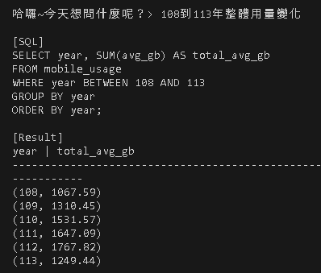
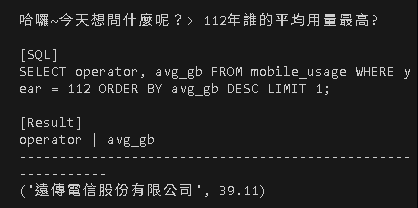
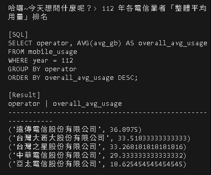

# 電信資料AI查詢助手

- 本專案使用LLM將使用者輸入的自然語言問題，轉換為SQL查詢，於 SQLite 執行並回傳查詢結果。
- 開發期間已在本機以自有API Key完成完整流程驗證，在此僅提供程式碼與查詢結果示意。
- 本專案為作品示範用途，金鑰未包含於此專案中。

> 本專案重點在於展示資料與AI應用的設計思路，並非對外提供的線上服務。

> 本專案使用 OpenAI API 進行自然語言轉 SQL，因此執行需自備 API Key 與可用額度。

---
###  查詢結果
 
使用者以中文輸入問題（例如：108年到113年整體用量變化）

112年平均用量最高的電信業者

112年各電信業者[整體平均用量]排名

